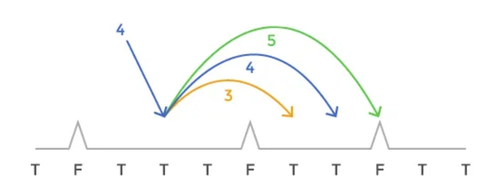

# Crazy Jumping Ball
url : https://medium.com/free-code-camp/follow-these-steps-to-solve-any-dynamic-programming-interview-problem-cc98e508cd0e

## The problem

1) Given a flat runaway with bunch of spikes in it. The runaway is represented by boolean array which indicates if a particular (discrete) spot is clear of spikes.


2) Given starting speed S. S is non-negative integer at any given point, and it indicates how much you will move forward with the next jump.

3) Every time you land on a spot, you can adjust your speed up to 1 unit before the next jump.



4) You want safely stop anywhere along the runaway (does not need to be at the and of the array). You stop when you speed becomes 0. However, if you land on a spike at any poin, your crazy bouncing ball bursts and it's game over.

5) The output should be boolean that indicate whether we can safely stop anywhere along the runaway.

## The Solution
1) How to recognize a Dynamic Programming problem

DP problem is a method for solving problems by breaking them down into a collection of simpler subproblems, solving each of those subproblems just once, and storing their solutions (this is an optimization using memo).

In the case of our example problem, given a point on the runway, a speed, and the runway ahead, we could determine the spots where we could potentially jump next. Furthermore, it seems that whether we can stop from the current speed depends only on whether we could stop from the point we choose to go to next.

```
Recognizing a Dynamic Programming problem is often the most difficult step in solving it. Can the problem solution be expressed as a function of solutions to similar smaller problems?
```

<br />

2) Identify problem variables

Next, we need to express the problem in terms of the function parameters and see which of those parameters are changing. A way to determine the number of changing parameters is to list examples of several subproblems and compare the parameters. Counting the number of changing parameters is valuable to determine the number of subproblems we have to solve. It's also important in its own right in helping us strengthen the understanding of the recurrence relation from step 1.

In this example, the two parameters that could change for every subproblem are :

<b>1. Array position (P)</b><br/>
<b>2. Speed (S)</b>

One could say that the runway ahead is changing as well, but that would be redundant considering that the entire non-changing runway and the position (P) carry that information already. Now, with these 2 changing parameters and other static parameters, we have the complete description of our sub-problems.

```
Identify the changing parameters and determine the number of subproblems.
```

<br />

3) Clearly express the recurrence relation

This is an important step that many rush through in order to get into coding. Expressing the recurrence relation as clearly as possible will strenghthen your problem understanding and make everything else significantly easier.

Let's assume that you have computed the subproblems. How could you compute the main problem?.

Because you can adjust your speed by up to 1 before jumping to the next position, there are only 3 possible speeds, and therefore 3 spots in which we could be next.

More formally, if our speed is S, position P, we could go from (S, P) to :

```
1. (S, P + S); # if we do not change the speed
2. (S - 1, P + S - 1); # if we change the speed by -1
3. (S + 1, P + S + 1); # if we change the speed by +1 
```

Let's call a function that we're trying to compute canStop. Then :

```
canStop(S, P) = canStop(S, P + S) || canStop(S - 1, P + S - 1) || canStop(S + 1, P + S + 1)
```

```
Recurrence relation: Assuming you have computed the subproblems, how would you compute the main problem?
```

<br />

4) Identify the base case

Base case is a subproblem that doesn't depend on any other subproblem. In order to find such subproblems, you typically want to try a few examples, see how your problem simplifies into smaller subproblems, and identify at what point it cannot be simplified further.

The reason a problem cannot be simplified further is that one of the parameters would become a value that is not possible given the <b>constraints</b> of the problem.

In the example problem, we have two changing parameters, S and P. Let's think about what possible values of S and P might not be legal :

<b> 1. P should be within the bounds of the given runway </b>

<b> 2. P cannot be such that runway[P] is false because that would mean that we're standing on a spike </b>

<b> 3. S cannot be negative, and a S == 0 indicates that we're done </b> 

Sometimes it can be a little challenging to convert assertions that we make about parameters into programmable base cases. This is because, in addition to listing the assertions if you want to make your code look concise and not check for unnecessary conditions, you also need to think about which of these are even possible.

In this example :

1. <b> P < 0 || P >= length runway </b> seems like the right thing to do. An alternative could be to consider making P == <b> end of runway </b> a base case. However, it is possible that a problem splits into a subproblem which goes beyond the end of the runway, so we really need to check for inequality.

2. This seems pretty obvious. We can simply check <b>if runway[P] is false.</b>

3. Similar to #1, we could simply check for S < 0 and S == 0. However, here we can reason that it is impossible for S to be < 0 because S decreases by at most 1, so it would have to go through S == 0 case beforehand. Therefore S == 0 is a sufficient base case for the S parameter.

5) Decide if you want to implement it iteratively or recursively

The both methods trade-offs
|   	                      | Recursive  	                      | Iterative  	                                       |
|---	                      |---	                              |---	                                               |
| Asymtotic time complexity | Same assuming memoization         | Same  	                                           |
| Memory usage  	          | Recursive stack, sparse memo      | Full memoization  	                               |
| Execution speed  	        | Often faster depends on the input | Slower, needs to do same work regardless the input |
| Stack overflow            | Problem                           | No issues as long as enough memory                 |
| Easier to implement       | Often easier to reason about      | Most people find it harder to reason through       |

<b> Stack overflow issues are typically a deal breaker </b> and a reason why you would not want to have recursion in a (backend) production system. However it's fine to use it in interview purposes with tradeoffs.

<br />

6) Using memoization (soon)

to do

7) Determine Time Complexity

There are some simple rules that can make computing time complexity of a dynamic programming problem much easier. Here are two steps that you need to do:

1. Count the number of states - this will depend on the number of changing parameters in your problem
2. Think about the work done per each state. In other words, if everything else but one state has been computed, how much work do you have to do to compute that last state?

In our example problem, the number of states is <b>|P| * |S|</b>, where

- P is set of all positions (|P| indicates the number of elements in P)
- S is the set of all speeds

The work done per each state is O(1) in this problem because, given all other states, we simply have to look at 3 subproblems to determine the resulting state.

As we noted in the code before, |S| is limited by length of the runway (|P|), so we could say that the number of states is |P|^2 and because work done per each sate is O(1), then the total time complexity is O(|P|^2).